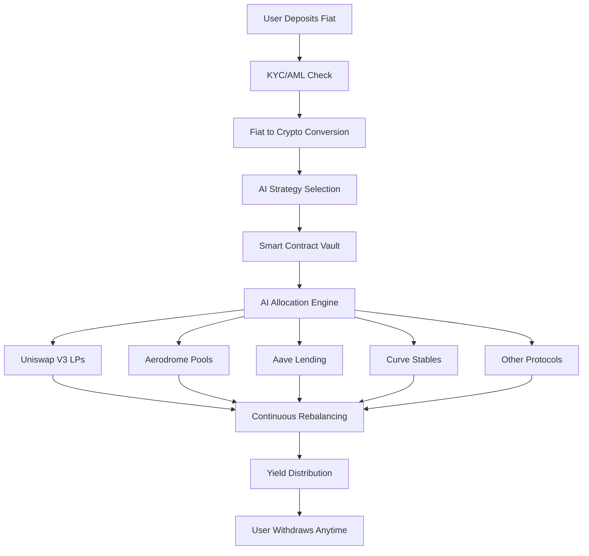

# 🚀 AutoYield AI - Intelligent DeFi Yield Optimization Platform

> **Turn your fiat into optimized DeFi yields with AI-powered strategy allocation**

AutoYield AI is a next-generation DeFi platform that makes yield farming accessible to everyone. Simply deposit fiat from any source, choose your risk profile, and let our AI agents handle the complex work of allocating your funds across the best yield opportunities in DeFi.

## 🎯 The Problem We Solve

DeFi yield farming is complex, time-consuming, and risky:
- **High barrier to entry**: Understanding liquidity pools, impermanent loss, and yield strategies requires deep DeFi knowledge
- **Constant monitoring**: Yields change rapidly; optimal strategies shift hourly
- **Gas inefficiency**: Individual users waste ETH rebalancing small positions
- **Risk management**: One wrong move can lead to significant losses

## 💡 Our Solution

AutoYield AI eliminates these barriers with:

### 1. **Simple Fiat Onramp**
- Connect your bank account, credit card, or payment app
- Deposit USD, EUR, or other major currencies
- Automatic conversion to crypto and deployment to yield strategies

### 2. **AI-Powered Strategy Selection**
Choose from risk profiles or let AI customize:
- **Conservative**: Stable yields (8-12% APY) via lending and stable LPs
- **Balanced**: Mixed strategies (12-20% APY) with moderate risk
- **Aggressive**: High-yield opportunities (20%+ APY) with active management
- **Custom**: Set your own parameters and let AI optimize within them

### 3. **Intelligent Allocation Engine**
Our AI agents continuously:
- Monitor yields across 50+ DeFi protocols
- Predict yield trends using on-chain analytics
- Rebalance positions to maximize returns
- Manage risk through diversification
- Harvest and compound rewards automatically

### 4. **Full Transparency**
- Real-time dashboard showing all positions
- Detailed performance analytics
- On-chain verification of all transactions
- No hidden fees - only a performance fee on profits

## 🛠️ How It Works



## 🌟 Key Features

### For Users
- **One-Click Yield Farming**: From fiat to farming in under 60 seconds
- **No DeFi Knowledge Required**: AI handles all complexity
- **Flexible Withdrawals**: Exit to fiat or crypto anytime
- **Mobile App**: Monitor and manage on the go
- **Tax Reporting**: Automated tax documents for your jurisdiction

### For DeFi Power Users
- **API Access**: Build on top of our strategies
- **Custom Strategies**: Define your own rules for AI to follow
- **Analytics Dashboard**: Deep insights into strategy performance
- **MEV Protection**: All transactions are MEV-resistant
- **Governance Rights**: Shape platform development

## 🔧 Technical Architecture

### Smart Contracts (Base Network)
- **Vault Contract**: ERC-4626 compliant vault for deposits/withdrawals
- **Strategy Modules**: Pluggable strategies for each protocol
- **AI Oracle**: On-chain AI decision feed for transparency
- **Fee Distributor**: Transparent fee collection and distribution

### AI Infrastructure
- **ML Models**: Trained on 3+ years of DeFi yield data
- **Real-time Analysis**: Sub-second decision making
- **Risk Management**: Multi-factor risk scoring for every position
- **Backtesting Engine**: Continuous strategy improvement

### Security
- **Audited Contracts**: Multiple audits by leading firms
- **Insurance Fund**: Protocol-owned insurance for user protection
- **Rate Limiting**: Protection against flash loan attacks
- **Multisig Admin**: No single point of failure

## 💰 Fee Structure

- **Deposit Fee**: 0%
- **Withdrawal Fee**: 0%
- **Management Fee**: 1%
- **Performance Fee**: 20% of profits (only charged on gains)
- **No hidden costs**: All protocol fees are included

## 🚀 Getting Started

### For Users
1. Visit [app.autoyield.ai](https://app.autoyield.ai)
2. Connect your bank account or card
3. Choose your deposit amount and strategy
4. Start earning immediately

### For Developers
```bash
# Clone the repo
git clone https://github.com/autoyield-ai/platform
cd platform

# Install dependencies
npm install
forge install

# Run tests
npm test
forge test

# Deploy locally
npm run deploy:local
```